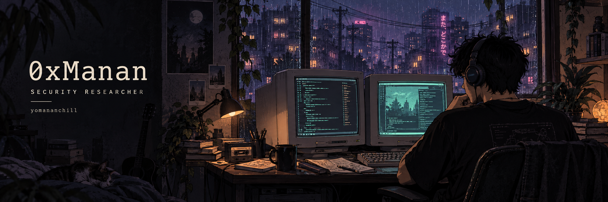

<div align="center">
<a href="https://yomananchill.github.io"></a>
<p><samp>i'm weird, i hack.</samp></p>
<p><a href="https://yomananchill.github.io"><b>WEBSITE</b></a> &nbsp; / &nbsp; <a href="https://yomananchill.github.io/#/disclosures"><b>RESEARCH</b></a> &nbsp; / &nbsp; <a href="https://x.com/0xManan"><b>X</b></a> &nbsp; / &nbsp; <a href="https://www.linkedin.com/in/manan-patel-4330101b4/"><b>LINKEDIN</b></a> &nbsp; / &nbsp; <a href="mailto:notmanan.ctf@gmail.com"><b>EMAIL</b></a></p>

</div>

<br>

### `01 / whoami`

I'm **Manan Patel**, a security researcher in **Bengaluru, India**.

I work on security and compliance at **Khatabook**. Independently, I read AI frameworks and open-source infrastructure, find bugs, and work with maintainers to get them fixed.

The code that interests me lives underneath the application: model loaders, browser engines, parsers, runtimes, and network stacks. My public record is on [my website](https://yomananchill.github.io).

<br>


### `02 / field notes`

**Five credited CVEs.** Here are the records, with links to the identifiers.

| Project | Research area | Public record |
| :--- | :--- | :--- |
| **Keras** | Model-loading safeguards | [CVE-2026-1462](https://www.cve.org/CVERecord?id=CVE-2026-1462) |
| **MLflow** | Webhook request validation | [CVE-2026-2393](https://www.cve.org/CVERecord?id=CVE-2026-2393) |
| **LoLLMs** | Event-handler access controls | [CVE-2026-1117](https://www.cve.org/CVERecord?id=CVE-2026-1117) |
| **LlamaIndex** | Filesystem isolation | [CVE-2025-6210](https://www.cve.org/CVERecord?id=CVE-2025-6210) |
| **LlamaIndex** | Image-path handling | [CVE-2025-6209](https://www.cve.org/CVERecord?id=CVE-2025-6209) |

My archive also includes issues I reported independently after another researcher. Those are labelled separately; the CVE credit belongs to the original reporter.

**[Read the disclosure archive →](https://yomananchill.github.io/#/disclosures)**

<br>

### `03 / things i've built`

**[Kryptonite](https://github.com/yomananchill/Kryptonite)**<br>
Memory acquisition for incident responders on Windows and Linux. Python and PowerShell. Built during the Kavach Hackathon.

**[SecureByte](https://github.com/yomananchill/SecureByte)**<br>
A cryptography research project combining AES and RSA. Python. Accompanies my [published research](https://www.jetir.org/view?paper=JETIR2403986).

<br>


### `04 / open tabs`

```text
research     AI/ML security · code review · vulnerability research
at work      AWS security · incident response · compliance
reading      browser engines · parsers · runtimes · network stacks
building     tools that help defenders do their work
```

[The codebase reading list →](https://yomananchill.github.io/#/audits)

<details>
<summary><b>Certifications & a few milestones</b></summary>
<br>

**Offensive security:** CRTO · CRT · CRTA · PT1 · eJPT · ACP<br>
**Defensive security:** CNSP · CAP

- **Khatabook Spark Award**, 2025 and 2026
- **Pentathon CTF**, top 25 finalist, 2024
- **Kavach Hackathon**, top 5 finalist, 2023
- **Hackvengers Hackathon**, first place, 2023
- **IWCON CTF**, runners-up, 2023

</details>

<br>

### `05 / commit after commit`

<picture>
  <source media="(prefers-color-scheme: light)" srcset="https://raw.githubusercontent.com/yomananchill/yomananchill/output/snake-light.svg">
  
</picture>

<br>

<div align="center">

<p><samp>found something interesting? let's talk.</samp></p>
<p><a href="mailto:notmanan.ctf@gmail.com">notmanan.ctf@gmail.com</a></p>
<p><samp>Bengaluru, IN &nbsp; / &nbsp; 0xManan &nbsp; / &nbsp; end of transmission</samp></p>
</div>
