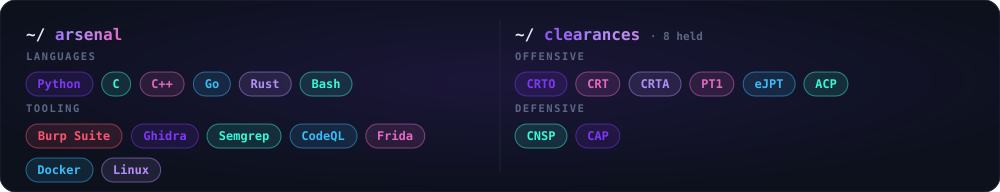

<div align="center">

<a href="https://yomananchill.github.io"></a>

<a href="https://yomananchill.github.io"></a>

</div>

```console
yomananchill@0xmanan:~$ whoami
Manan Patel  //  security researcher  //  Bengaluru

I work the layer under the application: AI/ML infrastructure, browser
engines, parsers, the plumbing everything else is built on. I take one
surface at a time and try to break it. Findings go upstream first, and
they only show up here once a fix has shipped.

Fintech security and compliance by day.
```

<br>

<div align="center">



**[→ read the writeups](https://yomananchill.github.io/#/disclosures)**

<br>


<br>



<br>


<br>

### `~/contact`

[](https://yomananchill.github.io) &nbsp; [](https://x.com/0xManan) &nbsp; [](https://www.linkedin.com/in/manan-patel-4330101b4) &nbsp; [](mailto:notmanan.ctf@gmail.com)

<br>

<sub></sub>


</div>
