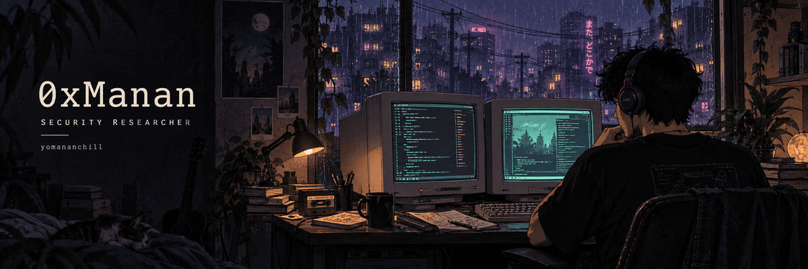
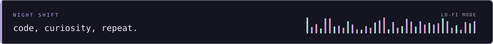

<a href="https://yomananchill.github.io"><picture><source media="(prefers-reduced-motion: reduce)" srcset="./assets/night-shift.png"></picture></a>

<samp>i'm weird, i hack.</samp>

<a href="https://yomananchill.github.io"><b>WEBSITE</b></a> &nbsp; / &nbsp; <a href="https://yomananchill.github.io/#/disclosures"><b>RESEARCH</b></a> &nbsp; / &nbsp; <a href="https://x.com/0xManan"><b>X</b></a> &nbsp; / &nbsp; <a href="https://www.linkedin.com/in/manan-patel-4330101b4/"><b>LINKEDIN</b></a> &nbsp; / &nbsp; <a href="mailto:notmanan.ctf@gmail.com"><b>EMAIL</b></a>

 

### `~/whoami`

I'm **Manan Patel**, a security researcher in **Bengaluru**. Security and compliance at **Khatabook** by day. Independent research into AI frameworks and open-source infrastructure outside work.

I read the code underneath the application: model loaders, browser engines, parsers, and runtimes. When I find something, I work with the maintainers to get it fixed.
 

### `~/research`

**Five credited CVEs** across Keras, MLflow, LoLLMs, and LlamaIndex.

| Project | Research area | Public record |
| :--- | :--- | :--- |
| **Keras** | Model-loading safeguards | [CVE-2026-1462](https://www.cve.org/CVERecord?id=CVE-2026-1462) |
| **MLflow** | Webhook request validation | [CVE-2026-2393](https://www.cve.org/CVERecord?id=CVE-2026-2393) |
| **LoLLMs** | Event-handler access controls | [CVE-2026-1117](https://www.cve.org/CVERecord?id=CVE-2026-1117) |
| **LlamaIndex** | Filesystem isolation | [CVE-2025-6210](https://www.cve.org/CVERecord?id=CVE-2025-6210) |
| **LlamaIndex** | Image-path handling | [CVE-2025-6209](https://www.cve.org/CVERecord?id=CVE-2025-6209) |

The full archive also includes independent reports. Those are labelled separately from my credited CVEs.

**[Read the disclosure archive →](https://yomananchill.github.io/#/disclosures)**

 

### `~/projects`

**[Kryptonite](https://github.com/yomananchill/Kryptonite)** 
Memory acquisition for incident responders on Windows and Linux. Python and PowerShell. Built during the Kavach Hackathon.

**[SecureByte](https://github.com/yomananchill/SecureByte)** 
A cryptography research project combining AES and RSA. Python. Accompanies my [published research](https://www.jetir.org/view?paper=JETIR2403986).

 

**Currently reading:** browser engines, parsers, runtimes, and network stacks. [Codebase list →](https://yomananchill.github.io/#/audits)

<b>Certifications & a few milestones</b>

 

**Offensive security:** CRTO · CRT · CRTA · PT1 · eJPT · ACP 
**Defensive security:** CNSP · CAP

- **Khatabook Spark Award**, 2025 and 2026
- **Pentathon CTF**, top 25 finalist, 2024
- **Kavach Hackathon**, top 5 finalist, 2023
- **Hackvengers Hackathon**, first place, 2023
- **IWCON CTF**, runners-up, 2023

 

### `~/contributions`

<picture>
  <source media="(prefers-color-scheme: light)" srcset="https://raw.githubusercontent.com/yomananchill/yomananchill/output/snake-light.svg">
  
</picture>

 

<samp>found something interesting? let's talk.</samp>

<a href="mailto:notmanan.ctf@gmail.com">notmanan.ctf@gmail.com</a>

<samp>0xManan &nbsp; / &nbsp; see you in the source.</samp>

